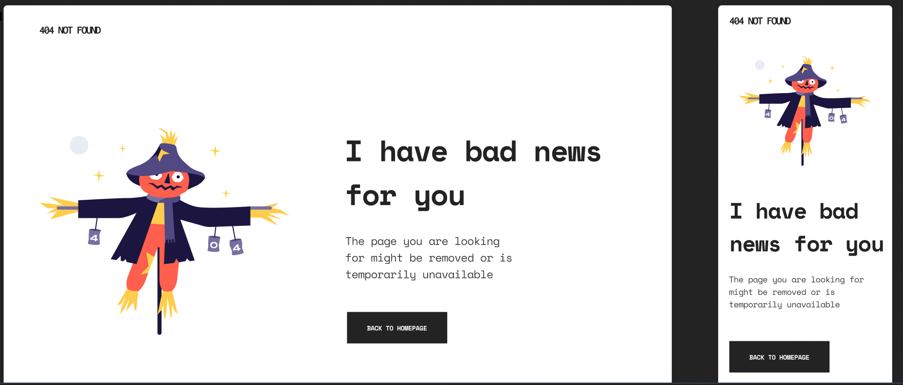

<!-- Please update value in the {}  -->

<h1 align="center">{404 Not Found}</h1>

   Solution for a challenge from  <a href="http://devchallenges.io" target="_blank">Devchallenges.io</a>.

  <h3>
    <a href="https://404-not-found-challenge-fran.netlify.app">
      Demo
    </a>
     | 
    <a href="https://devchallenges.io/challenges/wBunSb7FPrIepJZAg0sY">
      Challenge
    </a>
  </h3>

<!-- TABLE OF CONTENTS -->

## Table of Contents

- [Overview](#overview)
  - [Built With](#built-with)

<!-- OVERVIEW -->

## Overview
Simple page "404 Error Not found" made with HTML & CSS (Responsive & fluid design)

### Built With

<!-- This section should list any major frameworks that you built your project using. Here are a few examples.-->

 **HTML**

 
 **CSS**
